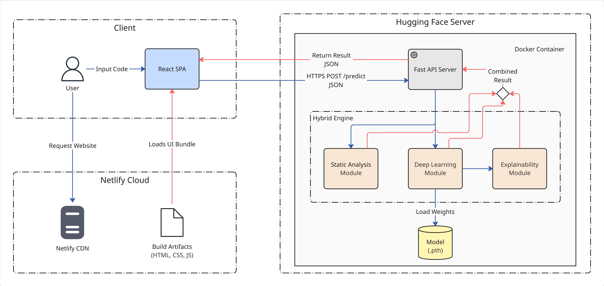
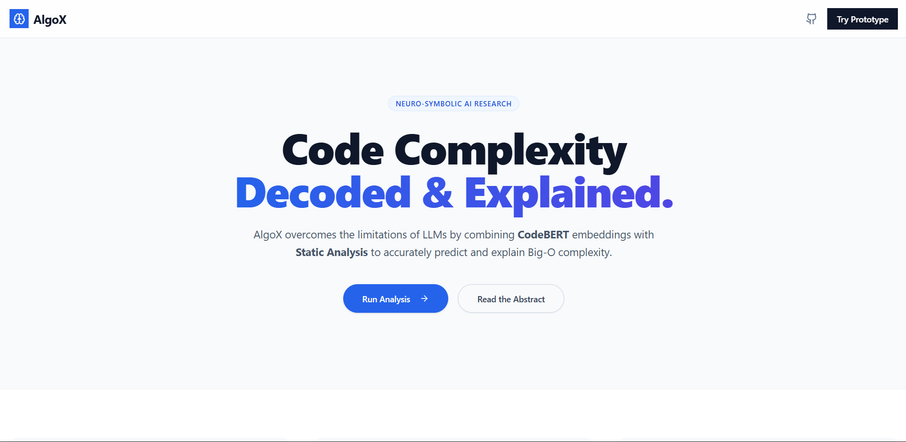
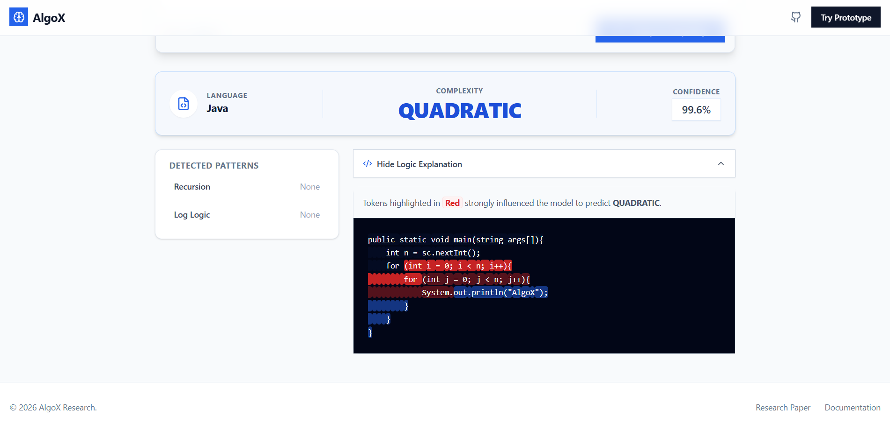

# AlgoX: Neuro-Symbolic Algorithm Complexity Analyzer

> **Final Year Research Project** > An Explainable AI-focused Approach for Time Complexity Classification of An Algorithm.

---

## 🚀 Live Demo
- **Frontend:** [https://algox-web.netlify.app](https://algox-webt.netlify.app)
- **Backend API:** [https://huggingface.co/spaces/himansha2001/algox-backend](https://huggingface.co/spaces/himansha2001/algox-backend/)

---

## 📖 Project Overview
AlgoX is a developer tool designed to bridge the gap between theoretical algorithm analysis and practical code optimization. Unlike standard profilers that require running code, AlgoX uses a **Neuro-Symbolic** approach to predict Time Complexity ($O(n)$, $O(n^2)$, etc.) statically.

It combines **Deep Learning (CodeBERT)** to understand code semantics with **Static Analysis (AST)** to detect structural patterns like recursion and nested loops.

### ✨ Key Features
* **Hybrid Analysis Engine:** Aggregates probability scores from a Transformer model with deterministic AST rules.
* **SHAP Explainability:** visualizes *why* a prediction was made by highlighting code tokens (Red = High Impact).
* **Multi-Language Support:** Auto-detects and parses **Java** and **Python**.
* **Professional Editor:** Integrated Monaco Editor (VS Code engine) with real-time syntax validation.

---

## 🏗️ System Architecture
The system follows a decoupled Client-Server architecture hosted on Netlify (Frontend) and Hugging Face Spaces (Backend).

---

## 🛠️ Tech Stack

### **Frontend (Client)**
* **Framework:** React 18 + Vite
* **Styling:** Tailwind CSS + Shadcn UI
* **Editor:** `@monaco-editor/react`
* **Visualization:** Framer Motion (Animations)
* **Hosting:** Netlify CDN

### **Backend (Server)**
* **API Framework:** FastAPI (Python 3.9)
* **ML Core:** PyTorch + Transformers (Hugging Face)
* **Model:** Microsoft CodeBERT (Fine-tuned)
* **Explainability:** SHAP (SHapley Additive exPlanations)
* **Static Analysis:** `javalang` (Java) & `ast` (Python)
* **Containerization:** Docker
* **Hosting:** Hugging Face Spaces (CPU Basic)

---

## 📸 Screenshots

### 1. Landing Page

### 2. Analysis Result (Quadratic Detection)

---